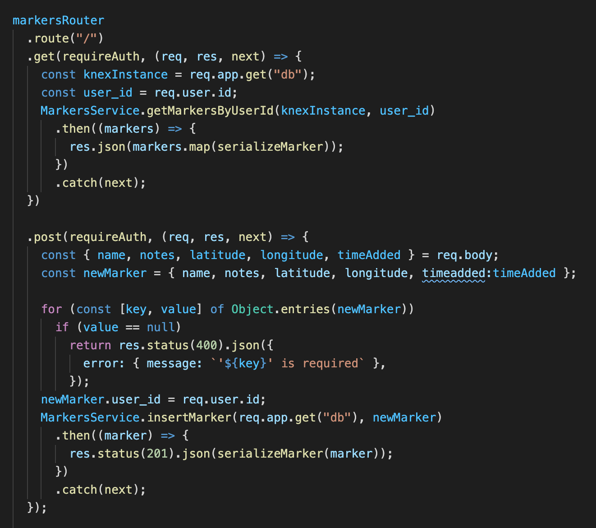

# Wanderer - API

Track your family and friends, without tracking your family and friends.

Live version: (https://wanderer.vercel.app/)

## Introduction 

Wanderer was developed to bridge the gap between safety and privacy. Location awareness of friends and family can be a great safety tool. But knowing their exact location at all times can sometimes be a breach of privacy. Wanderer allows users to decide when to share their location with others, leaving a trail of breadcrumbs with their whereabouts.

The main features include 
* Summary of application features 
* View recent locations of members 
* Add your location


## Technologies

* Node and Express  
  * RESTful API 
* Testing 
  * Supertest (integration) 
  * Mocha and Chai (unit)
* Database 
  * Postgres
  * Knex.js 
  
## Production 

Deployed via Heroku

## API Endpoints


### Folders Router
```
- /api/markers
- - GET - gets all markers 
- - POST - creates a new marker
```


